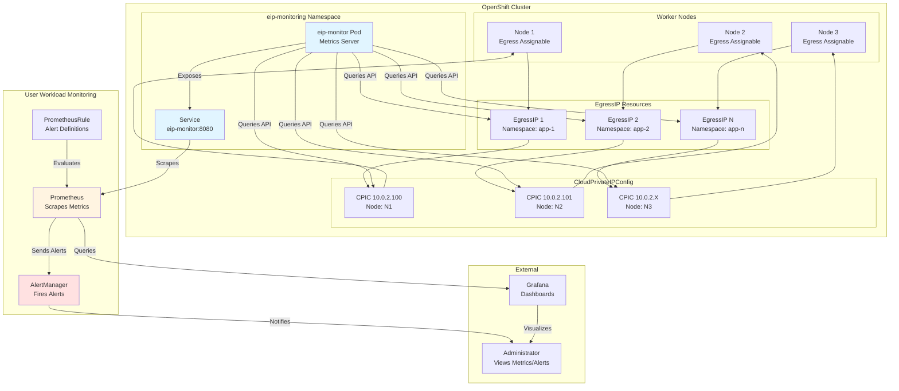

# OpenShift EIP Monitoring

Monitoring solution for OpenShift Egress IP (EIP) and CloudPrivateIPConfig (CPIC) resources. Exposes Prometheus metrics and alerts.

## Prerequisites

- OpenShift 4.18+
- User Workload Monitoring enabled
- EgressIP feature enabled

## Quick Start

```bash
# Build and deploy
./scripts/deploy-eip.sh all -r quay.io/your-registry

# Or deploy with existing image
oc apply -f k8s/deployment/k8s-manifests.yaml
```

## Architecture

Integrates with OpenShift User Workload Monitoring to collect metrics and generate alerts for EgressIP and CloudPrivateIPConfig resources.



### Component Overview

- **eip-monitor**: Python Flask application that queries the OpenShift API for EgressIP and CPIC resources and exposes Prometheus metrics
- **ServiceMonitor**: Configures Prometheus to scrape metrics from the eip-monitor service
- **PrometheusRule**: Defines alert rules for EIP utilization, assignment status, CPIC errors, and cluster health
- **Prometheus**: Collects and stores metrics, evaluates alert rules
- **AlertManager**: Handles alert routing and notifications

## User Workload Monitoring Setup

**Required**: Enable User Workload Monitoring in OpenShift:

```bash
# Enable user workload monitoring
oc -n openshift-monitoring edit configmap cluster-monitoring-config
```

Add to the ConfigMap:
```yaml
data:
  config.yaml: |
    enableUserWorkload: true
```

```bash
# Enable alerting
oc apply -f - <<EOF
apiVersion: v1
kind: ConfigMap
metadata:
  name: user-workload-monitoring-config
  namespace: openshift-user-workload-monitoring
data:
  config.yaml: |
    alertmanager:
      enabled: true
      enableAlertmanagerConfig: true
EOF
```

## Installation

### Method 1: Automated Build and Deploy
```bash
git clone https://github.com/rh-john/ocp-eip-monitoring.git
cd ocp-eip-monitoring
./scripts/deploy-eip.sh all -r quay.io/your-registry
```

### Method 2: Deploy with Pre-built Image
```bash
oc new-project eip-monitoring
oc apply -f k8s/deployment/k8s-manifests.yaml
```

## Configuration

| Variable | Description | Default |
|----------|-------------|---------|
| `SCRAPE_INTERVAL` | Metrics collection interval (seconds) | `30` |
| `PORT` | HTTP server port | `8080` |
| `LOG_LEVEL` | Logging level | `INFO` |
| `EIP_CAPACITY_PER_NODE` | Maximum EIPs per node for capacity calculations | `75` |

## Metrics

Exposes metrics for EIP and CPIC monitoring. Core metrics:

- `eips_configured_total` - Total configured EIPs
- `eips_assigned_total` - Total assigned EIPs  
- `eips_unassigned_total` - Total unassigned EIPs
- `eip_utilization_percent` - EIP utilization percentage
- `cpic_success_total` - Successful CPIC resources
- `cpic_error_total` - Error CPIC resources
- `node_eip_assigned_total` - EIPs assigned per node

Additional metrics include distribution fairness (Gini coefficient), health scores, API performance, and historical trends.

See [Metrics Reference](docs/ENHANCED_METRICS_GUIDE.md) for complete metrics catalog.

## Alerts

Alert rules for EIP and CPIC monitoring. Core alerts:

- **EIPUtilizationCritical**: EIP utilization > 95%
- **EIPNotAssigned**: Unassigned EIPs detected
- **CPICErrors**: CPIC resources in error state
- **ClusterEIPHealthCritical**: Cluster health score < 50

Additional alerts cover distribution, capacity, API performance, node health, trends, and monitoring system status.

See [Metrics Reference](docs/ENHANCED_METRICS_GUIDE.md) for complete alert catalog.

## Usage

### View Metrics
```bash
# Port-forward to access metrics
oc port-forward service/eip-monitor 8080:8080 -n eip-monitoring
curl http://localhost:8080/metrics
```

### Testing
```bash
# Deploy test EgressIPs with default settings (15 IPs, 4 namespaces, auto-distribute)
./scripts/deploy-test-eips.sh deploy

# Deploy with custom IP and namespace counts (auto-distribute)
./scripts/deploy-test-eips.sh deploy 20 5

# Deploy with fixed EIPs per namespace (3 EIPs each)
./scripts/deploy-test-eips.sh deploy 20 5 3

# Scale up/down: Change IP count or namespace count (preserves existing assignments)
./scripts/deploy-test-eips.sh deploy 50 10  # Scale to 50 IPs, 10 namespaces
./scripts/deploy-test-eips.sh deploy 30 6   # Scale down to 30 IPs, 6 namespaces

# Change distribution: Adjust EIPs per namespace (preserves existing IPs, adds new ones)
./scripts/deploy-test-eips.sh deploy 90 30   # Change from 3 IPs/ns to auto-distribute 90 IPs over 30 namespaces

# Clean up test resources  
./scripts/deploy-test-eips.sh cleanup

# Redistribute failed CPICs to healthy nodes (excludes nodes with CPIC errors)
./scripts/deploy-test-eips.sh redistribute
```

**Note**: The deployment script preserves existing IPs when scaling and only updates what's needed.

### Verification
```bash
# Check deployment
oc get pods -n eip-monitoring

# Check metrics
oc exec deployment/eip-monitor -n eip-monitoring -- curl -s http://localhost:8080/metrics | head -10
```

## Troubleshooting

**No metrics appearing:**
```bash
# Check user workload monitoring
oc get pods -n openshift-user-workload-monitoring

# Test metrics endpoint
oc exec deployment/eip-monitor -n eip-monitoring -- curl -s http://localhost:8080/metrics
```

**Alerts not firing:**
```bash
# Check AlertManager is running
oc get pods -n openshift-user-workload-monitoring | grep alertmanager

# Verify PrometheusRule
oc get prometheusrule eip-monitor-alerts -n eip-monitoring
```

## Project Structure

```
ocp-eip-monitoring/
├── src/metrics_server.py          # Core monitoring application
├── k8s/                           # Kubernetes manifests
│   ├── deployment/
│   │   └── k8s-manifests.yaml     # Deployment resources (includes Service, Deployment, RBAC, etc.)
│   ├── monitoring/                # Monitoring infrastructure (COO/UWM)
│   └── grafana/                   # Grafana dashboards and configuration
├── scripts/                       # Operational scripts
│   ├── deploy-eip.sh              # Build and deployment
│   ├── deploy-monitoring.sh       # Deploy monitoring infrastructure (COO/UWM)
│   ├── deploy-grafana.sh          # Deploy Grafana operator and dashboards
│   ├── deploy-test-eips.sh        # Test EIP creation and CPIC redistribution
│   ├── test/
│   │   ├── test-monitoring-deployment.sh  # Monitoring tests
│   └── lib/                       # Shared script library
│       └── common.sh              # Common functions (pod finding, logging, prerequisites)
├── tests/                         # Test suites
│   └── e2e/                       # End-to-end tests
│       ├── test-monitoring-e2e.sh # E2E monitoring tests
│       └── test-uwm-grafana-e2e.sh # E2E Grafana tests
└── docs/                          # Documentation
    ├── CONTAINER_DEPLOYMENT.md    # Deployment guide
    └── ENHANCED_METRICS_GUIDE.md  # Complete metrics and alerts reference (50+ metrics, 30+ alerts)
```

## Scripts and Automation

### Shared Library

The project includes a shared library (`scripts/lib/common.sh`) that provides reusable functions for:
- **Pod Finding**: Locate Prometheus, ThanosQuerier, and Grafana pods using multiple selector strategies
- **Logging**: Consistent logging functions (`log_info`, `log_success`, `log_warn`, `log_error`)
- **Prerequisites**: Check for required tools (`oc`, `jq`) and cluster connectivity
- **Resource Waiting**: Wait for Kubernetes resources and pods to become ready
- **Helper Functions**: `oc_cmd()` and `oc_cmd_silent()` for verbose mode handling

**Usage in scripts:**
```bash
# Source the common library
SCRIPT_DIR="$(cd "$(dirname "${BASH_SOURCE[0]}")" && pwd)"
PROJECT_ROOT="$(dirname "$SCRIPT_DIR")"
source "${PROJECT_ROOT}/scripts/lib/common.sh"

# Use shared functions
find_prometheus_pod "$NAMESPACE" "true"
find_query_pod "$NAMESPACE" "true"
check_prerequisites
```

### Key Scripts

- **`scripts/deploy-monitoring.sh`**: Deploy COO or UWM monitoring infrastructure
- **`scripts/deploy-grafana.sh`**: Deploy Grafana operator, instance, and dashboards
- **`scripts/test/test-monitoring-deployment.sh`**: Monitoring verification
- **`tests/e2e/test-monitoring-e2e.sh`**: End-to-end monitoring tests
- **`tests/e2e/test-uwm-grafana-e2e.sh`**: End-to-end Grafana deployment tests

All scripts use the shared `common.sh` library for consistent behavior and reduced code duplication.

## Documentation

- [Deployment Guide](docs/CONTAINER_DEPLOYMENT.md) - Deployment instructions
- [Metrics Reference](docs/ENHANCED_METRICS_GUIDE.md) - Metrics and alerts catalog
- [Branch Strategy](docs/BRANCH_STRATEGY.md) - Git workflow
- [Release Process](docs/RELEASE_PROCESS.md) - Release workflow
- [E2E Tests](tests/e2e/README.md) - End-to-end testing
- [Grafana Dashboards](k8s/grafana/README.md) - Dashboard documentation

## License

This project is provided as-is for OpenShift EIP monitoring and analysis.

## About Me

**John Johansson**  
*Specialist Adoption Architect at Red Hat*

I specialize in helping organizations successfully adopt and optimize OpenShift deployments. This EIP monitoring tool was developed to address real-world observability needs for OpenShift Egress IP management.

Connect with me for OpenShift architecture guidance, best practices, and advanced monitoring solutions.