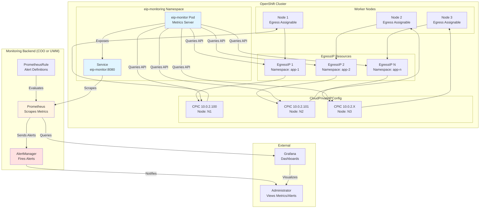

# OpenShift EIP Monitoring

A monitoring solution for OpenShift Egress IP (EIP) and CloudPrivateIPConfig (CPIC) resources that exposes Prometheus metrics and alerts.

## Prerequisites

- OpenShift 4.18+
- EgressIP feature enabled
- **Monitoring Option (choose one):**
  - **User Workload Monitoring (UWM)**: Built-in OpenShift monitoring capability
  - **Cluster Observability Operator (COO)**: Standalone monitoring operator

## Quick Start

```bash
# 1. Build and deploy eip-monitor application
./scripts/build-and-deploy.sh build -r quay.io/your-registry
./scripts/build-and-deploy.sh deploy

# 2. Deploy monitoring infrastructure (choose COO or UWM)
# Option A: Deploy with Cluster Observability Operator (COO)
./scripts/build-and-deploy.sh monitoring --monitoring-type coo

# Option B: Deploy with User Workload Monitoring (UWM)
./scripts/build-and-deploy.sh monitoring --monitoring-type uwm

# Or deploy with existing image
oc apply -f k8s/deployment/k8s-manifests.yaml
```

## Architecture

The EIP monitoring solution supports two monitoring backends:
- **Cluster Observability Operator (COO)**: Namespace-scoped Prometheus and Alertmanager managed by COO
- **User Workload Monitoring (UWM)**: OpenShift's built-in user workload monitoring with Thanos Querier integration

Both options provide the same metrics and alerting capabilities, allowing you to choose based on your cluster's monitoring strategy.



### Component Overview

- **eip-monitor**: Python Flask application that queries the OpenShift API for EgressIP and CPIC resources and exposes Prometheus metrics
- **ServiceMonitor**: Configures Prometheus to scrape metrics from the eip-monitor service (COO or UWM specific)
- **PrometheusRule**: Defines alert rules for EIP utilization, assignment status, CPIC errors, and cluster health (COO or UWM specific)
- **Prometheus**: Collects and stores metrics, evaluates alert rules (managed by COO or UWM)
- **AlertManager**: Handles alert routing and notifications (managed by COO or UWM)

## Monitoring Backend Options

### Option 1: Cluster Observability Operator (COO)

COO provides namespace-scoped Prometheus and Alertmanager instances. The deployment script automatically installs and configures COO.

**Deployment:**
```bash
./scripts/build-and-deploy.sh monitoring --monitoring-type coo
```

**What it does:**
- Installs COO operator subscription
- Creates MonitoringStack CR with Prometheus and Alertmanager
- Applies COO-specific ServiceMonitor and PrometheusRule
- Configures namespace-scoped RBAC

**Advantages:**
- Namespace-scoped monitoring (isolated from cluster monitoring)
- Full control over Prometheus configuration
- Independent retention and storage policies

### Option 2: User Workload Monitoring (UWM)

UWM is OpenShift's built-in capability for monitoring user-defined projects. The deployment script automatically enables and configures UWM.

**Deployment:**
```bash
./scripts/build-and-deploy.sh monitoring --monitoring-type uwm
```

**What it does:**
- Enables UWM in `cluster-monitoring-config`
- Enables AlertManager for user workloads
- Applies UWM-specific ServiceMonitor and PrometheusRule
- Configures cluster-scoped RBAC for Thanos Querier access

**Advantages:**
- Integrated with OpenShift cluster monitoring
- Access to cluster-scoped metrics via Thanos Querier
- Managed by OpenShift (no additional operator needed)

**Note:** UWM requires cluster-admin permissions to enable.

## Installation

### Method 1: Automated Build and Deploy

**Step 1: Build and deploy eip-monitor application**
```bash
git clone https://github.com/rh-john/ocp-eip-monitoring.git
cd ocp-eip-monitoring

# Build container image
./scripts/build-and-deploy.sh build -r quay.io/your-registry -t v1.0.0

# Deploy eip-monitor (no monitoring infrastructure)
./scripts/build-and-deploy.sh deploy
```

**Step 2: Deploy monitoring infrastructure (choose one)**

**Option A: COO**
```bash
./scripts/build-and-deploy.sh monitoring --monitoring-type coo
```

**Option B: UWM**
```bash
./scripts/build-and-deploy.sh monitoring --monitoring-type uwm
```

**All-in-one (build, push, deploy eip-monitor, then deploy monitoring):**
```bash
./scripts/build-and-deploy.sh all -r quay.io/your-registry
./scripts/build-and-deploy.sh monitoring --monitoring-type coo  # or uwm
```

### Method 2: Deploy with Pre-built Image
```bash
oc new-project eip-monitoring

# Deploy eip-monitor application
oc apply -f k8s/deployment/k8s-manifests.yaml

# Deploy monitoring (choose one)
# For COO:
oc apply -f k8s/monitoring/coo/monitoring/servicemonitor-coo.yaml
oc apply -f k8s/monitoring/coo/monitoring/prometheusrule-coo.yaml

# For UWM:
oc apply -f k8s/monitoring/uwm/monitoring/servicemonitor-uwm.yaml
oc apply -f k8s/monitoring/uwm/monitoring/prometheusrule-uwm.yaml
```

### Switching Between Monitoring Types

To switch from one monitoring type to another:
```bash
# Remove current monitoring
./scripts/build-and-deploy.sh monitoring --remove-monitoring

# Deploy new monitoring type
./scripts/build-and-deploy.sh monitoring --monitoring-type coo  # or uwm
```

## Configuration

| Variable | Description | Default |
|----------|-------------|---------|
| `SCRAPE_INTERVAL` | Metrics collection interval (seconds) | `30` |
| `PORT` | HTTP server port | `8080` |
| `LOG_LEVEL` | Logging level | `INFO` |

## Key Metrics

- `eips_configured_total` - Total configured EIPs
- `eips_assigned_total` - Total assigned EIPs  
- `eips_unassigned_total` - Total unassigned EIPs
- `eip_utilization_percent` - EIP utilization percentage
- `cpic_success_total` - Successful CPIC resources
- `cpic_error_total` - Error CPIC resources
- `node_eip_assigned_total` - EIPs assigned per node

## Key Alerts

- **EIPUtilizationCritical**: EIP utilization > 95%
- **EIPNotAssigned**: Unassigned EIPs detected
- **CPICErrors**: CPIC resources in error state
- **ClusterEIPHealthCritical**: Cluster health score < 50

## Usage

### View Metrics

**Direct from pod:**
```bash
# Port-forward to access metrics
oc port-forward service/eip-monitor 8080:8080 -n eip-monitoring
curl http://localhost:8080/metrics
```

**From Prometheus (COO):**
```bash
# Port-forward to COO Prometheus
oc port-forward service/eip-monitoring-stack-prometheus 9090:9090 -n eip-monitoring
# Access Prometheus UI at http://localhost:9090
```

**From Prometheus (UWM):**
```bash
# Access via Thanos Querier (requires cluster-monitoring-view permissions)
oc port-forward service/thanos-querier 9091:9091 -n openshift-monitoring
# Access Thanos Querier at https://localhost:9091
```

### Deploy Grafana (Optional)

Grafana deployment is handled separately. See the `grafana` branch for Grafana deployment scripts:
```bash
# Deploy Grafana for COO
./scripts/deploy-grafana.sh --monitoring-type coo

# Deploy Grafana for UWM
./scripts/deploy-grafana.sh --monitoring-type uwm
```

### Testing
```bash
# Deploy test EgressIPs with default settings (15 IPs, 4 namespaces, auto-distribute)
./scripts/deploy-test-eips.sh deploy

# Deploy with custom IP and namespace counts (auto-distribute)
./scripts/deploy-test-eips.sh deploy 20 5

# Deploy with fixed EIPs per namespace (3 EIPs each)
./scripts/deploy-test-eips.sh deploy 20 5 3

# Scale up/down: Change IP count or namespace count (preserves existing assignments)
./scripts/deploy-test-eips.sh deploy 50 10  # Scale to 50 IPs, 10 namespaces
./scripts/deploy-test-eips.sh deploy 30 6   # Scale down to 30 IPs, 6 namespaces

# Change distribution: Adjust EIPs per namespace (preserves existing IPs, adds new ones)
./scripts/deploy-test-eips.sh deploy 90 30   # Change from 3 IPs/ns to auto-distribute 90 IPs over 30 namespaces

# Clean up test resources  
./scripts/deploy-test-eips.sh cleanup

# Redistribute failed CPICs to healthy nodes (excludes nodes with CPIC errors)
./scripts/deploy-test-eips.sh redistribute
```

**Note**: The deployment script intelligently handles changes:
- **Preserves existing IPs**: When increasing distribution, existing IPs remain assigned and new ones are added
- **Smart scaling**: Detects existing configurations and only updates what's needed
- **Distribution changes**: Allows changing IP distribution without full reassignment

### Verification
```bash
# Check deployment
oc get pods -n eip-monitoring

# Check metrics
oc exec deployment/eip-monitor -n eip-monitoring -- curl -s http://localhost:8080/metrics | head -10
```

## Troubleshooting

**No metrics appearing:**
```bash
# Test metrics endpoint
oc exec deployment/eip-monitor -n eip-monitoring -- curl -s http://localhost:8080/metrics

# For COO: Check Prometheus pods
oc get pods -n eip-monitoring -l app.kubernetes.io/name=prometheus

# For UWM: Check user workload monitoring
oc get pods -n openshift-user-workload-monitoring

# Verify ServiceMonitor
oc get servicemonitor -n eip-monitoring
```

**Alerts not firing:**
```bash
# For COO: Check AlertManager pods
oc get pods -n eip-monitoring -l app.kubernetes.io/name=alertmanager

# For UWM: Check AlertManager is running
oc get pods -n openshift-user-workload-monitoring | grep alertmanager

# Verify PrometheusRule
oc get prometheusrule -n eip-monitoring
```

## Project Structure

```
ocp-eip-monitoring/
├── src/metrics_server.py          # Core monitoring application
├── k8s/                           # Kubernetes manifests
│   ├── deployment/                # Shared deployment resources
│   │   └── k8s-manifests.yaml    # eip-monitor deployment
│   ├── grafana/                   # Shared Grafana resources
│   │   ├── grafana-operator.yaml # Grafana operator subscription
│   │   ├── grafana-instance.yaml # Grafana instance
│   │   └── grafana-dashboard-*.yaml  # Dashboard definitions
│   └── monitoring/                # Monitoring-specific resources
│       ├── coo/                   # Cluster Observability Operator
│       │   ├── operator/          # COO operator subscription
│       │   ├── monitoring/        # ServiceMonitor, PrometheusRule
│       │   ├── grafana/          # COO-specific datasource
│       │   └── rbac/             # COO-specific RBAC
│       └── uwm/                   # User Workload Monitoring
│           ├── monitoring/        # ServiceMonitor, PrometheusRule
│           ├── grafana/           # UWM-specific datasource
│           └── rbac/              # UWM-specific RBAC
├── scripts/                       # Operational scripts
│   ├── build-and-deploy.sh       # Build, deploy, and monitoring management
│   ├── deploy-test-eips.sh       # Test EIP creation and CPIC redistribution
│   └── test-*.sh                  # End-to-end test scripts
└── docs/                          # Documentation
    ├── CONTAINER_DEPLOYMENT.md    # Deployment guide
    └── ENHANCED_METRICS_GUIDE.md  # Metrics reference
```

## Documentation

- **[Deployment Guide](docs/CONTAINER_DEPLOYMENT.md)** - Complete deployment instructions
- **[Metrics Reference](docs/ENHANCED_METRICS_GUIDE.md)** - All metrics and alerts

## License

This project is provided as-is for OpenShift EIP monitoring and analysis.

## About Me

**John Johansson**  
*Specialist Adoption Architect at Red Hat*

I specialize in helping organizations successfully adopt and optimize OpenShift deployments. This EIP monitoring tool was developed to address real-world observability needs for OpenShift Egress IP management.

Connect with me for OpenShift architecture guidance, best practices, and advanced monitoring solutions.