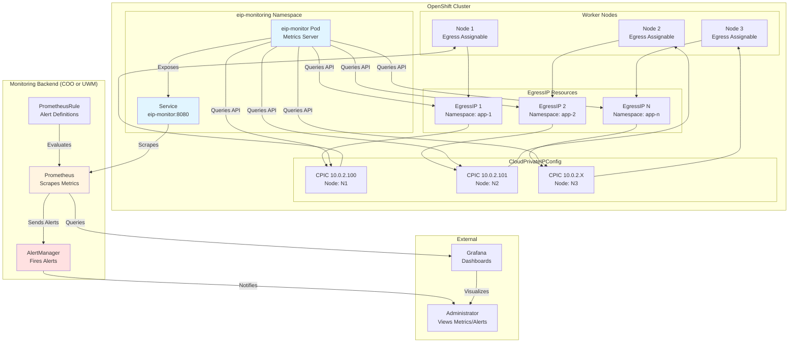

# OpenShift EIP Monitoring

A monitoring solution for OpenShift Egress IP (EIP) and CloudPrivateIPConfig (CPIC) resources that exposes Prometheus metrics and alerts.

## Prerequisites

- OpenShift 4.18+
- User Workload Monitoring enabled (or COO monitoring infrastructure)
- EgressIP feature enabled
- **Monitoring Option (choose one):**
  - **User Workload Monitoring (UWM)**: Built-in OpenShift monitoring capability
  - **Cluster Observability Operator (COO)**: Standalone monitoring operator

## Development Workflow

This project uses a component-based branching strategy with automated CI/CD:

- **Component Branches**: `dev` (eip-monitor), `coo` (monitoring infrastructure), `grafana` (dashboards)
- **Integration Branch**: `staging` (auto-versioning, pre-release tags, container builds)
- **Release Branch**: `main` (production releases)

**Quick Reference:**
- Work on component branches (`dev`, `coo`, `grafana`) independently
- Merge to `staging` for integration testing and automated builds
- Merge `staging` → `main` for production releases

See [docs/BRANCH_STRATEGY.md](docs/BRANCH_STRATEGY.md) and [docs/RELEASE_PROCESS.md](docs/RELEASE_PROCESS.md) for details.

**Container Images:**
- Pre-releases: `quay.io/<namespace>/eip-monitor:v<version>-rc<number>`
- Releases: `quay.io/<namespace>/eip-monitor:v<version>` and `latest`
- Nightly builds: `quay.io/<namespace>/eip-monitor:<branch>-<date>`

## Quick Start

**Step 1: Install monitoring infrastructure**

Install monitoring infrastructure (COO or UWM):
```bash
./scripts/build-and-deploy.sh monitoring --monitoring-type coo  # or uwm
```

**Step 2: Deploy EIP Monitor**

Deploy the EIP monitoring application:
```bash
./scripts/build-and-deploy.sh deploy -r quay.io/your-registry
```

**Step 3: Deploy Grafana Dashboards (Optional)**

Deploy Grafana dashboards for visualization:
```bash
./scripts/deploy-grafana.sh --monitoring-type coo  # or uwm (must match Step 1)
```

**Note:** The monitoring type (COO or UWM) must match between Step 1 and Step 3.

## Architecture

The EIP monitoring solution supports two monitoring backends:
- **Cluster Observability Operator (COO)**: Namespace-scoped Prometheus and Alertmanager managed by COO
- **User Workload Monitoring (UWM)**: OpenShift's built-in user workload monitoring with Thanos Querier integration

Both options provide the same metrics and alerting capabilities, allowing you to choose based on your cluster's monitoring strategy.



### Component Overview

- **eip-monitor**: Python Flask application that queries the OpenShift API for EgressIP and CPIC resources and exposes Prometheus metrics
- **ServiceMonitor**: Configures Prometheus to scrape metrics from the eip-monitor service (COO or UWM specific)
- **PrometheusRule**: Defines alert rules for EIP utilization, assignment status, CPIC errors, and cluster health (COO or UWM specific)
- **Prometheus**: Collects and stores metrics, evaluates alert rules (managed by COO or UWM)
- **AlertManager**: Handles alert routing and notifications (managed by COO or UWM)

## Monitoring Backend Options

### Option 1: Cluster Observability Operator (COO)

COO provides namespace-scoped Prometheus and Alertmanager instances. The deployment script automatically installs and configures COO.

**Deployment:**
```bash
./scripts/build-and-deploy.sh monitoring --monitoring-type coo
```

**What it does:**
- Installs COO operator subscription
- Creates MonitoringStack CR with Prometheus and Alertmanager
- Applies COO-specific ServiceMonitor and PrometheusRule
- Configures namespace-scoped RBAC

**Advantages:**
- Namespace-scoped monitoring (isolated from cluster monitoring)
- Full control over Prometheus configuration
- Independent retention and storage policies

### Option 2: User Workload Monitoring (UWM)

UWM is OpenShift's built-in capability for monitoring user-defined projects. The deployment script automatically enables and configures UWM.

**Deployment:**
```bash
./scripts/build-and-deploy.sh monitoring --monitoring-type uwm
```

**What it does:**
- Enables UWM in `cluster-monitoring-config`
- Enables AlertManager for user workloads
- Applies UWM-specific ServiceMonitor and PrometheusRule
- Configures cluster-scoped RBAC for Thanos Querier access

**Advantages:**
- Integrated with OpenShift cluster monitoring
- Access to cluster-scoped metrics via Thanos Querier
- Managed by OpenShift (no additional operator needed)

**Note:** UWM requires cluster-admin permissions to enable.

## Installation

### Prerequisites: Install Monitoring Infrastructure

**This branch only contains Grafana resources. You must first install the monitoring infrastructure from the `coo` branch:**

```bash
# Clone and switch to coo branch
git clone https://github.com/rh-john/ocp-eip-monitoring.git
cd ocp-eip-monitoring
git checkout coo

# Install monitoring infrastructure (choose COO or UWM)
./scripts/build-and-deploy.sh monitoring --monitoring-type coo
# OR
./scripts/build-and-deploy.sh monitoring --monitoring-type uwm
```

### Deploy Grafana (This Branch)

**After monitoring infrastructure is installed, switch to this branch and deploy Grafana:**

```bash
# Switch to grafana branch
git checkout grafana

# Deploy Grafana (must match the monitoring type from above)
./scripts/deploy-grafana.sh --monitoring-type coo
# OR
./scripts/deploy-grafana.sh --monitoring-type uwm
```

### Manual Deployment

If you prefer to deploy Grafana resources manually:

```bash
# Deploy Grafana operator and instance (shared)
oc apply -f k8s/grafana/grafana-operator.yaml
oc apply -f k8s/grafana/grafana-instance.yaml

# Deploy monitoring-specific datasource and RBAC
# For COO:
oc apply -f k8s/monitoring/coo/grafana/grafana-datasource-coo.yaml
oc apply -f k8s/monitoring/coo/rbac/grafana-rbac-coo.yaml

# For UWM:
oc apply -f k8s/monitoring/uwm/grafana/grafana-datasource-uwm.yaml
oc apply -f k8s/monitoring/uwm/rbac/grafana-rbac-uwm.yaml

# Deploy dashboards
oc apply -f k8s/grafana/grafana-dashboard-*.yaml
```

## Configuration

| Variable | Description | Default |
|----------|-------------|---------|
| `SCRAPE_INTERVAL` | Metrics collection interval (seconds) | `30` |
| `PORT` | HTTP server port | `8080` |
| `LOG_LEVEL` | Logging level | `INFO` |

## Key Metrics

- `eips_configured_total` - Total configured EIPs
- `eips_assigned_total` - Total assigned EIPs  
- `eips_unassigned_total` - Total unassigned EIPs
- `eip_utilization_percent` - EIP utilization percentage
- `cpic_success_total` - Successful CPIC resources
- `cpic_error_total` - Error CPIC resources
- `node_eip_assigned_total` - EIPs assigned per node

## Key Alerts

- **EIPUtilizationCritical**: EIP utilization > 95%
- **EIPNotAssigned**: Unassigned EIPs detected
- **CPICErrors**: CPIC resources in error state
- **ClusterEIPHealthCritical**: Cluster health score < 50

## Usage

### Access Grafana

After deploying Grafana, access it via the OpenShift route:

```bash
# Get Grafana route URL
oc get route -n eip-monitoring | grep grafana

# Or port-forward to Grafana service
oc port-forward service/eip-monitoring-grafana-service 3000:3000 -n eip-monitoring
# Access at http://localhost:3000
```

### View Metrics in Grafana

1. Log in to Grafana (default credentials may be in the Grafana instance manifest)
2. Navigate to Dashboards
3. Browse the pre-configured EIP monitoring dashboards

### View Metrics Directly
```bash
# Port-forward to access metrics endpoint
oc port-forward service/eip-monitor 8080:8080 -n eip-monitoring
curl http://localhost:8080/metrics
```

### Testing
```bash
# Deploy test EgressIPs with default settings (15 IPs, 4 namespaces, auto-distribute)
./scripts/deploy-test-eips.sh deploy

# Deploy with custom IP and namespace counts (auto-distribute)
./scripts/deploy-test-eips.sh deploy 20 5

# Deploy with fixed EIPs per namespace (3 EIPs each)
./scripts/deploy-test-eips.sh deploy 20 5 3

# Scale up/down: Change IP count or namespace count (preserves existing assignments)
./scripts/deploy-test-eips.sh deploy 50 10  # Scale to 50 IPs, 10 namespaces
./scripts/deploy-test-eips.sh deploy 30 6   # Scale down to 30 IPs, 6 namespaces

# Change distribution: Adjust EIPs per namespace (preserves existing IPs, adds new ones)
./scripts/deploy-test-eips.sh deploy 90 30   # Change from 3 IPs/ns to auto-distribute 90 IPs over 30 namespaces

# Clean up test resources  
./scripts/deploy-test-eips.sh cleanup

# Redistribute failed CPICs to healthy nodes (excludes nodes with CPIC errors)
./scripts/deploy-test-eips.sh redistribute
```

**Note**: The deployment script intelligently handles changes:
- **Preserves existing IPs**: When increasing distribution, existing IPs remain assigned and new ones are added
- **Smart scaling**: Detects existing configurations and only updates what's needed
- **Distribution changes**: Allows changing IP distribution without full reassignment

### Verification
```bash
# Check deployment
oc get pods -n eip-monitoring

# Check metrics
oc exec deployment/eip-monitor -n eip-monitoring -- curl -s http://localhost:8080/metrics | head -10
```

## Troubleshooting

**No metrics appearing:**
```bash
# Test metrics endpoint
oc exec deployment/eip-monitor -n eip-monitoring -- curl -s http://localhost:8080/metrics

# For COO: Check Prometheus pods
oc get pods -n eip-monitoring -l app.kubernetes.io/name=prometheus

# For UWM: Check user workload monitoring
oc get pods -n openshift-user-workload-monitoring

# Verify ServiceMonitor
oc get servicemonitor -n eip-monitoring
```

**Alerts not firing:**
```bash
# For COO: Check AlertManager pods
oc get pods -n eip-monitoring -l app.kubernetes.io/name=alertmanager

# For UWM: Check AlertManager is running
oc get pods -n openshift-user-workload-monitoring | grep alertmanager

# Verify PrometheusRule
oc get prometheusrule -n eip-monitoring
```

## Project Structure

**This branch (grafana) contains only Grafana resources:**

```
ocp-eip-monitoring/
├── k8s/
│   ├── grafana/                   # Shared Grafana resources
│   │   ├── grafana-operator.yaml # Grafana operator subscription
│   │   ├── grafana-instance.yaml # Grafana instance
│   │   ├── grafana-dashboard-*.yaml  # Dashboard definitions (23 dashboards)
│   │   └── *.md                   # Grafana documentation
│   └── monitoring/                # Monitoring-specific Grafana resources
│       ├── coo/                   # COO-specific
│       │   ├── grafana/          # COO Grafana datasource
│       │   └── rbac/             # COO Grafana RBAC
│       └── uwm/                   # UWM-specific
│           ├── grafana/           # UWM Grafana datasource
│           └── rbac/              # UWM Grafana RBAC
└── scripts/
    └── deploy-grafana.sh          # Grafana deployment script
```

**For monitoring infrastructure (COO/UWM), eip-monitor tool, and other resources, see the [`coo` branch](https://github.com/rh-john/ocp-eip-monitoring/tree/coo).**

## Documentation

- **[Deployment Guide](docs/CONTAINER_DEPLOYMENT.md)** - Complete deployment instructions
- **[Metrics Reference](docs/ENHANCED_METRICS_GUIDE.md)** - All metrics and alerts

## License

This project is provided as-is for OpenShift EIP monitoring and analysis.

## About Me

**John Johansson**  
*Specialist Adoption Architect at Red Hat*

I specialize in helping organizations successfully adopt and optimize OpenShift deployments. This EIP monitoring tool was developed to address real-world observability needs for OpenShift Egress IP management.

Connect with me for OpenShift architecture guidance, best practices, and advanced monitoring solutions.